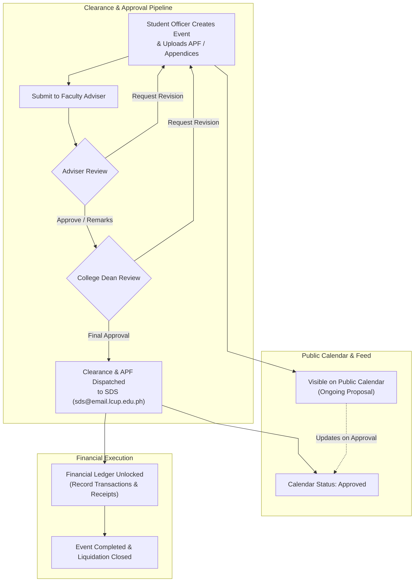

# COLLinSight

> **College Student Organization Management and Governance System with Automated Compliance Monitoring**\
> Developed for the **College of Information Technology and Engineering (CITE)** — _La Consolacion University Philippines (LCUP)_.

---

## 📌 Overview

**COLLinSight** is a comprehensive web-based governance and management platform designed to streamline student organization operations, digitize multi-level event proposal clearance workflows, monitor financial ledgers with automated liquidation tracking, and maintain strict institutional compliance across departments.



---

## ✨ Key Features

### 🏛️ Multi-Stage Governance & Clearance Pipeline

- **Draft & Compliance Uploads:** Student officers submit event proposals with complete requisites, Activity Proposal Forms (APF), and supplementary appendices.
- **Hierarchical Approval:** Streamlined progression through Faculty Adviser review and final College Dean authorization.
- **Automated SDS Integration:** Generates official clearance documents and simulates email dispatch to Student Development Services (`sds@email.lcup.edu.ph`).
- **Revision Cycles:** Granular feedback loops allowing advisers and the dean to request specific amendments before final endorsement.

### 💰 Financial Ledger & Liquidation

- **Budget Monitoring:** Real-time visibility into organization budget allocations, event expenditure caps, and remaining balances.
- **Transaction Records:** Detailed expense tracking categorizing venue, logistics, catering, honorariums, and materials with mandatory receipt attachments.
- **Automated Liquidation Reports:** Post-event revenue declaration and liquidation summary generation, locking closed event ledgers while supporting formal remarks/amendments.

### 🌐 Public Portal & Organization Directory

- **Interactive Landing Page:** Modern interface showcasing upcoming activities, institutional workflows, and developer information.
- **Department Feeds:** Filterable feeds for academic departments (**BSIT**, **BSCpE**, **BSIE**) highlighting student leadership and upcoming events.
- **Live Event Calendar:** Public calendar with real-time status indicators and detailed event modal views.

### 🔐 Role-Based Portals (RBAC)

| Role                     | Core Capabilities                                                                                                                                     |
| ------------------------ | ----------------------------------------------------------------------------------------------------------------------------------------------------- |
| **Student Officers**     | Create & manage event proposals, log expenses & upload receipts, track SDS submissions, view org analytics, submit for liquidation.                   |
| **Faculty Advisers**     | Review assigned organization proposals (Approve, Approve with Remarks, Return for Revision), monitor financial ledgers, view org reports.             |
| **College Dean**         | College-wide pending approval queue, digital signatory endorsement, cross-departmental financial analytics, clearance archive.                        |
| **System Administrator** | Manage academic departments and organizations, allocate annual budget caps, configure event types & expenditure categories, audit logs, manage users. |

---

## 🚀 Quick Start

### Prerequisites

- **Node.js** (v20.x or higher recommended)
- **npm**, **pnpm**, or **yarn**

### Installation

1. **Clone the repository:**
   ```bash
   git clone https://github.com/your-username/comms-collinsight.git
   cd comms-collinsight
   ```

1. **Install dependencies:**
   ```bash
   npm install
   ```

1. **Start the local development server:**

   ```bash
   npm run dev
   ```

   Open http://localhost:8443 (or the port specified in terminal output) in your browser.

1. **Build for production:**
   ```bash
   npm run build
   ```

---

## 🔑 Demo Accounts

For local demonstration and evaluation, the following pre-configured credentials are available on the Login Portal:

| Role                            | Email                        | Password            | Assigned Organization   |
| ------------------------------- | ---------------------------- | ------------------- | ----------------------- |
| **Student Officer (President)** | `mlopez@student.cite.edu.ph` | `lopez_124983`      | IT Student Guild (ITSG) |
| **Faculty Adviser**             | `ereyes@cite.edu.ph`         | `reyes_773012`      | IT Student Guild (ITSG) |
| **College Dean**                | `dean@cite.edu.ph`           | `villanueva_441209` | CITE (College-wide)     |
| **System Administrator**        | `admin@cite.edu.ph`          | `cruz_882341`       | System-wide             |

---

## 🏗️ Project Structure

```
comms-collinsight/
├── src/
│   ├── components/
│   │   ├── layout/       # Layout shells, responsive navigation & sidebars
│   │   └── ui/           # Design system components (dialogs, tabs, cards, tables, badges)
│   ├── context/          # Global React contexts (AuthContext, AppContext)
│   ├── pages/
│   │   ├── admin/        # System configuration, user management, and audit trail
│   │   ├── adviser/      # Proposal review queue, organization finance & reports
│   │   ├── dean/         # College-wide approval queue, approved events & analytics
│   │   └── student/      # Proposal builder, financial ledger, SDS workspace & reports
│   └── services/         # Domain models, type definitions, utilities & seed data
```

---

## 🛠️ Technology Stack

- **Framework:** [React 19](https://react.dev/) + [Vite 8](https://vite.dev/)
- **Language:** [TypeScript 5.7](https://www.typescriptlang.org/)
- **Styling:** [Tailwind CSS v4](https://tailwindcss.com/)
- **Routing:** [React Router v7](https://reactrouter.com/)
- **Icons:** [Lucide React](https://lucide.dev/)
- **Charts & Visualizations:** [Recharts](https://recharts.org/)

---

## 📄 License

This project is created for academic and organizational governance purposes for the **College of Information Technology and Engineering (CITE)** at **La Consolacion University Philippines (LCUP)**.
